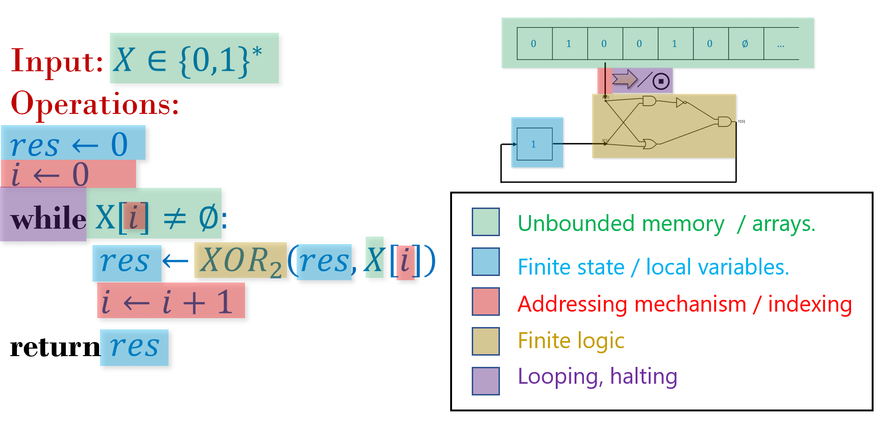
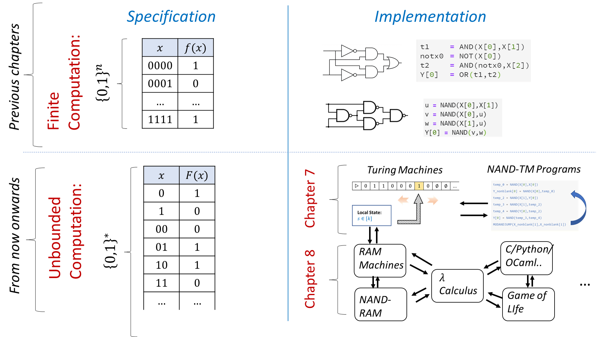
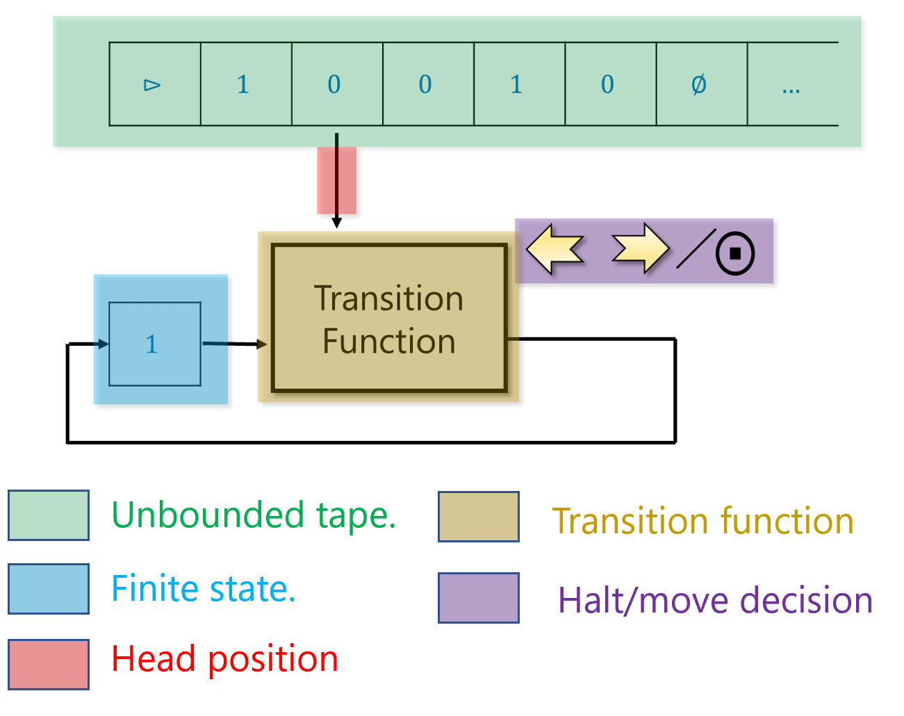
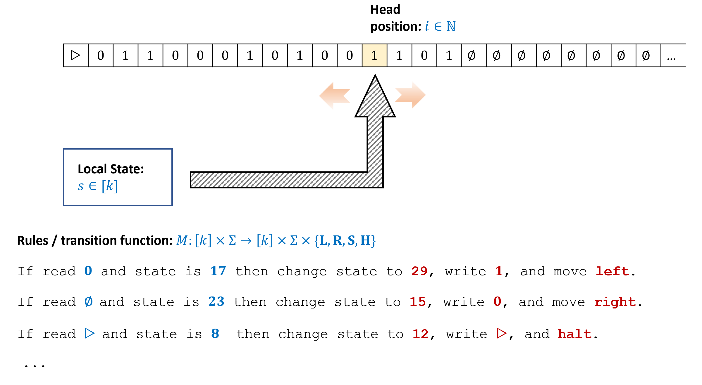
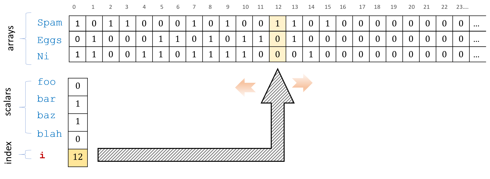
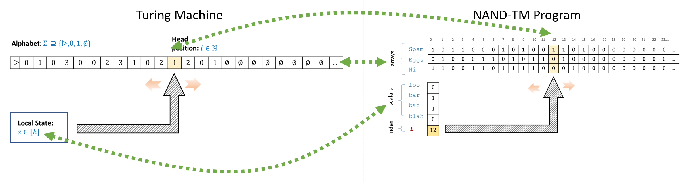
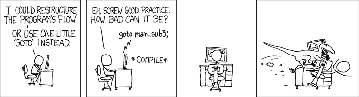

<!-- toc -->

# 7. 循环与无穷性 { #chaploops }

## 学习目标 { .objectives }
* 学习 **图灵机** 的模型, 其可以计算 **任意长度输入** 的函数.
* 通过 NAND-TM 程序了解图灵机的程序语言描述, 其在 NAND-CIRC 的基础上增加了 **循环** 和 **数组**.
* 了解图灵机与 NAND-TM 程序的一些基本语法糖和等价的变体.

```admonish quote
"然而, 一旦把[打孔]卡片的想法付诸实现, 算数的界限就已被超越了;
而分析机与普通的"计算机器"决不可同日而语... 
其让机械装置得以将一般的符号, 以无限多样和无限广延的序列组合起来, 
从而在物质的操作与数学科学中最抽象分支的抽象心智过程之间, 建立起一条联结的纽带."

*——Ada Augusta, Lovelace 伯爵夫人, 1843*
```

正如 [第六章](chapter_6.md) 的引言所述, 算法是 "以有限回答无穷". 为了表示一个算法,
我们需要写下一组有限多的指令, 其能够计算任意长度的输入.

我们需要以下组件来描述和执行一个算法 (见 {{ref:fig:algcomponents}}):

* 一组有限多的用于执行的指令.
* 在执行过程中被使用的一些 "局部变量" 或有限状态.
* 一个潜在的无界工作内存, 用于存储输入和我们可能需要的其他值.
* 当内存无界时, 我们每一步只能读写其中的有限部分, 我们需要一种方式来 **寻址** 我们想要读写的内存部分.
* 如果我们只有有限多的指令, 但我们的输入可以是任意长的, 我们将需要 **重复** 指令 (即 **循环** 回去). 我们需要一种机制来决定何时循环, 何时停止.

```admonish pic id="algcomponentfig"


{{pic}}{fig:algcomponents} 算法是对任意长度输入进行计算的有限方式. 算法的组件包括用于执行的指令、有限状态或"局部变量"、用于存储输入和中间计算结果的内存, 以及决定访问内存哪一部分、何时重复指令以及何时停止的机制.
```

```admonish info title="简要概述"
本章将给出一种通用的算法模型. 它不同于布尔电路, 不受固定输入长度的限制; 也不同于有限自动机, 不受有限工作内存的限制.
我们将看到两种算法建模方式:

* **图灵机** 由 Alan Turing 于 1936 年提出, 是一种假想的抽象设备, 可以用有限的描述表示能够处理任意长度输入的算法.

* **NAND-TM 编程语言** 在 NAND-CIRC 的基础上引入 **循环** 和 **数组** 的概念, 从而得到能够计算输入长度任意之函数的有限程序.

事实证明, 这两个模型是 **等价的**. 实际上, 它们还与许多其他计算模型等价, 包括 C、Lisp、Python、JavaScript 等编程语言. 这一概念称为 **图灵等价性** 或 **图灵完备性**, 将在[第 8 章](chapter_8.md)中讨论.
本章与[第 8 章](chapter_8.md)所介绍模型的概览见 {{ref:fig:chaploopoverview}}.
```


```admonish pic id="chaploopoverviewfig"


{{pic}}{fig:chaploopoverview} 有限计算与无界计算模型概览. 前面几章研究 **有限函数** 的计算, 即对于某些固定的 $n,m$, 形如 $f:\{0,1\}^n\rightarrow\{0,1\}^m$ 的函数; 我们使用电路或直线程序来模拟这些函数的计算. 本章研究形如 $F:\{0,1\}^*\rightarrow\{0,1\}^m$ 或 $F:\{0,1\}^*\rightarrow\{0,1\}^*$ 的 **无界函数** 的计算. 我们使用 **图灵机** 或与之等价的 NAND-TM 程序来模拟这些函数的计算; NAND-TM 程序在 NAND-CIRC 编程语言中加入了 **循环** 的概念. 在[第 8 章](chapter_8.md)中, 我们将证明这些模型与许多其他模型等价, 包括 RAM 机、$\lambda$ 演算, 以及 C、Python、Java、JavaScript 等所有常见的编程语言.
```


## 7.1 图灵机

```admonish quote
"计算通常通过在纸上写下某些符号来完成. 我们可以假设, 这张纸像儿童的算术本一样被划分成方格...  [人类] 计算员在任何时刻的行为, 取决于他正在观察的符号以及他在那一刻的 '思维状态 '... 我们可以假设, 一次简单操作至多改变一个符号."\
"我们把正在进行计算的人... 比作一台只能处于有限多种格局之一的机器... 这台机器配有一条 '磁带 ' (相当于纸张)... 磁带被划分成若干区段 (称为'方格'), 每个方格都能承载一个 '符号'."

*——Alan Turing, 1936*
```

```admonish quote
"图灵机与现代计算机之间有什么区别? 这就像希拉里登上珠穆朗玛峰与在峰顶开设一家希尔顿酒店之间的区别."

*——Alan Perlis, 1982*
```

```admonish pic id="turingrunning"


{{pic}}{fig:alan-turing-running} 除诸多其他成就外, Alan Turing 还是一位出色的长跑运动员, 只差一点便入选英格兰奥运代表队.一位跑友曾问他为什么要在训练中如此折磨自己.Alan 回答说: "我的工作压力太大, 只有奋力奔跑才能把它从脑海中赶走; 这是我得到些许解脱的唯一方式." 
```

所有计算模型的 "鼻祖" 是 **图灵机**.
Alan Turing 于 1936 年定义了图灵机, 试图形式化地刻画遵循一组明确定义的规则 (例如标准加法或乘法算法) 的人类 "计算员" (见 {{ref:fig:HumanComputers}}) 所能计算的全部函数.

```admonish pic id="humancomputersfig"


{{pic}}{fig:HumanComputers}
在电子计算机出现之前, "computer" 一词指的是执行计算的人.这些 "人类计算员" 大多是女性, 她们对许多成就都至关重要, 包括绘制星图、破解 Enigma 密码以及 NASA 太空任务; 另见参考文献说明.照片来自 [National Photo Company Collection](https://www.loc.gov/pictures/item/2016838906/); 另见 [Sobel, 2017](https://scholar.google.com/scholar?q=Dava+Sobel+The+Glass+Universe).
```

Turing 设想, 这样的人可以按需取用任意多的 "草稿纸".
为简单起见, 可以把这张草稿纸想成一条一维的方格纸 (通常称为 **磁带**).
纸被划分成若干 "单元" , 每个 "单元" 可以容纳一个符号 (例如一个数字或字母, 更一般地说, 是某个有限 **字母表** 中的元素).
在任意时刻, 这个人都可以读取或写入纸上的一个单元.他可以根据该单元的内容更新自己有限的思维状态, 并且/或者移动到当前单元紧邻的左侧或右侧单元.


```admonish pic id="steamturingmachine"


{{pic}}{fig:SPTM} 蒸汽动力图灵机壁画, 由华盛顿大学计算机科学与工程专业的研究生于 1987 年春季资格考试前夜绘制.图片来自 [https://www.cs.washington.edu/building/art/SPTM](https://www.cs.washington.edu/building/art/SPTM).
```


Turing 用一台维持 $k$ 种状态之一的 "机器" 来模拟这种计算.
在任意时刻, 机器从它的 "工作磁带" 上读取有限字母表 $\Sigma$ 中的一个符号, 并据此更新自身状态、写入磁带, 还可能移动到相邻单元(见 {{ref:fig:turingmachine}}).
为了用这台机器计算函数 $F$, 我们用输入 $x\in \{0,1\}^*$ 初始化磁带, 目标是确保计算结束时磁带包含值 $F(x)$.
具体而言, 具有 $k$ 个状态和字母表 $\Sigma$ 的图灵机 $M$ 在输入 $x\in \{0,1\}^*$ 上的计算过程如下: 

* 最初, 机器处于状态 $0$ (称为"初始状态"), 磁带被初始化为 $\triangleright,x_0,\ldots,x_{n-1},\varnothing,\varnothing,\ldots$. 我们用符号 $\triangleright$ 表示磁带的起点, 用符号 $\varnothing$ 表示空白单元.我们始终假定字母表 $\Sigma$ 是 $\{\triangleright, \varnothing , 0 , 1\}$ 的超集 (可能是真超集).
* 将机器所指向的位置 $i$ 设为 $0$.
* 在每一步中, 机器读取磁带第 $i$ 个位置上的符号 $\sigma=T[i]$.机器根据该符号及其状态 $s$ 决定: 
  - 在磁带上写入什么符号 $\sigma'$; \
  - 向**左** (**L**eft, 即 $i\leftarrow i-1$) 移动、向**右** (**R**ight, 即 $i\leftarrow i+1$) 移动、**停留** (**S**tay) 在原处, 还是**停机** (**H**alt) ; 
  - 新状态 $s\in[k]$ 是什么.
* 图灵机所遵循的规则集合称为它的 **转移函数**.
* 机器停机时, 从磁带起点开始读取, 直到第一个包含 $\varnothing$ 符号的位置, 并依次输出其中所有的 $0$ 和 $1$ 符号, 由此得到的二进制串即为机器的输出; 若开头存在 $\triangleright$ 符号, 则将其丢弃, 末尾的 $\varnothing$ 符号同样丢弃.

```admonish pic id="turingmachinecomponentsfig"


{{pic}}{fig:turingmachinecomponents} 图灵机的组成部分.请注意它们如何与 {{ref:fig:algcomponents}} 所述的算法一般组成部分相对应.
```

### 7.1.1 扩展示例: 识别回文的图灵机 { #turingmachinepalindrome }

令 $PAL$ (表示 **回文**) 为如下函数: 对于输入 $x\in\{0,1\}^*$, 当且仅当 $x$ 是一个 (长度为偶数的) **回文** 时输出 $1$; 这里回文是指存在某个 $n\in\N$ 和 $w\in\{0,1\}^n$, 使得 $x=w_0\cdots w_{n-1}w_{n-1}w_{n-2}\cdots w_0$.

下面给出一台计算 $PAL$ 的图灵机 $M$.为了描述 $M$, 我们需要指定 __(i)__ $M$ 的磁带字母表 $\Sigma$, 它至少应包含符号 $0$、$1$、$\triangleright$ 和 $\varnothing$; 以及 __(ii)__ $M$ 的 **转移函数**, 它决定 $M$ 处于特定状态并读到给定符号时所采取的动作.

在本例中, $M$ 使用字母表 $\{0,1,\triangleright,\varnothing,\times\}$, 并具有 $k=11$ 个状态. 尽管这些状态只是从 $0$ 到 $k-1$ 的数字, 但为方便起见, 我们给它们加上如下标签: 

| 状态 | 标签 |
| --- | --- |
| 0 | `START` |
| 1 | `RIGHT_0` |
| 2 | `RIGHT_1` |
| 3 | `LOOK_FOR_0` |
| 4 | `LOOK_FOR_1` |
| 5 | `RETURN` |
| 6 | `OUTPUT_0` |
| 7 | `OUTPUT_1` |
| 8 | `0_AND_BLANK` |
| 9 | `1_AND_BLANK` |
| 10 | `BLANK_AND_STOP` |

下面用文字描述图灵机 $M$ 的运行过程: 

* $M$ 从 `START` 状态开始向右移动, 寻找第一个为 $0$ 或 $1$ 的符号.如果尚未遇到这样的符号便先遇到 $\varnothing$, 它就转入下文所述的 `OUTPUT_1` 状态.

* 一旦 $M$ 找到这样的符号 $b\in\{0,1\}$, 它便写入 $\times$ 符号, 以此从磁带上删除 $b$; 随后进入 `RIGHT_`$b$ 状态并开始向右移动, 直到遇到第一个 $\varnothing$ 或 $\times$ 符号.

* $M$ 找到该符号后, 根据此前处于 `RIGHT_0` 还是 `RIGHT_1` 状态, 分别转入 `LOOK_FOR_0` 或 `LOOK_FOR_1` 状态, 并向左移动一步.

* 在 `LOOK_FOR_`$b$ 状态下, $M$ 检查磁带上的值是否为 $b$. 如果是, $M$ 就把该值改为 $\times$ 以将其删除, 并转入 `RETURN` 状态; 否则, 它转入 `OUTPUT_0` 状态.

* `RETURN` 状态表示 $M$ 返回起点. 具体来说, $M$ 不断向左移动, 直到遇到第一个既不是 $0$ 也不是 $1$ 的符号, 此时它将状态改为 `START`.

* `OUTPUT_`$b$ 状态表示 $M$ 最终将输出值 $b$. 在 `OUTPUT_0` 和 `OUTPUT_1` 状态下, $M$ 都会向左移动, 直到遇到 $\triangleright$. 随后它向右移动一步, 并分别转入 `1_AND_BLANK` 或 `0_AND_BLANK` 状态. 在后两个状态中, $M$ 写入相应的值, 向右移动, 然后转入 `BLANK_AND_STOP` 状态; 在该状态下, 它向磁带写入 $\varnothing$ 并停机.

可以把上述描述转换成一个表格, 列出 $11\cdot 5$ 种状态与符号的组合, 并说明图灵机处于相应状态、读到相应符号时将执行什么操作.这个表格称为图灵机的 **转移函数**.

### 7.1.2 图灵机: 形式化定义

```admonish pic id="turing-machine-fig"


{{pic}}{fig:turingmachine} 图灵机可以访问一条长度无界的 **磁带**. 在执行过程中的任意时刻, 机器都能读取磁带上的一个符号, 并根据该符号及其当前状态写入新符号、更新磁带, 以及决定向左移动、向右移动、停留在原处还是停机.
```

图灵机的形式化定义如下: 

```admonish quote title=""
{{defc}}{def:TM}[Machine]

一台具有 $k$ 个状态、字母表满足 $\Sigma\supseteq\{0,1,\triangleright,\varnothing\}$ 的 (单带) **图灵机** $M$, 由一个 **转移函数** 表示: 
$\delta_M:[k]\times \Sigma \rightarrow [k] \times \Sigma  \times \{\mathsf{L},\mathsf{R}, \mathsf{S}, \mathsf{H} \}$.

对于每个 $x\in\{0,1\}^*$, $M$ 在输入 $x$ 上的 **输出** 记作 $M(x)$, 它是以下过程的结果: 

* 将 $T$ 初始化为序列 $\triangleright,x_0,x_1,\ldots,x_{n-1},\varnothing,\varnothing,\ldots$, 其中 $n=|x|$. (也就是说, $T[0]=\triangleright$; 对 $i\in[n]$, 有 $T[i+1]=x_i$; 对 $i>n$, 有 $T[i]=\varnothing$.) 

* 同时初始化 $i=0$ 和 $s=0$.

* 然后重复以下过程: 
   1. 令 $(s',\sigma',D)=\delta_M(s,T[i])$.
   2. 令 $s\leftarrow s'$, $T[i]\leftarrow\sigma'$.
   3. 如果 $D=\mathsf{R}$, 则令 $i\rightarrow i+1$; 如果 $D=\mathsf{L}$, 则令 $i\rightarrow\max\{i-1,0\}$. (如果 $D=\mathsf{S}$, 则保持 $i$ 不变.) 
   4. 如果 $D=\mathsf{H}$, 则停机.

* 如果上述过程停机, 则 $M$ 的输出记作 $M(x)$, 它是字符串 $y\in\{0,1\}^*$: 设 $i+1$ 是磁带上第一个包含 $\varnothing$ 的位置, 将 $T[0],\ldots,T[i]$ 中所有属于 $\{0,1\}$ 的符号依次连接起来, 即得到 $y$.

* 如果图灵机不停机, 则记作 $M(x)=\bot$.
```


```admonish pause title="暂停一下"
你应当确保自己理解这个形式化定义为何与前面对图灵机的非形式化描述相对应.
为了对图灵机形成更直观的认识, 可以探索一些在线模拟器, 例如 [Martin Ugarte 的模拟器](https://turingmachinesimulator.com/)、[Anthony Morphett 的模拟器](http://morphett.info/turing/turing.html)或 [Paul Rendell 的模拟器](http://rendell-attic.org/gol/TMapplet/index.htm).
```

不要将图灵机 $M$ 的 **转移函数** $\delta_M$ 与该机器所计算的函数混淆.
转移函数 $\delta_M$ 是一个 **有限** 函数, 有 $k|\Sigma|$ 个输入和 $4k|\Sigma|$ 个输出. (你能看出为什么吗?) 
这台机器可以计算一个 **无限** 函数 $F$: 它以任意长度的字符串 $x\in\{0,1\}^*$ 为输入, 也可能产生任意长度的字符串作为输出.

在我们的形式化定义中, 机器 $M$ 与其转移函数 $\delta_M$ 被视为同一对象, 因为转移函数给出了我们需要知道的关于图灵机的一切信息.
不过, 这种表示方式的选择有一定任意性, 并且建立在如下约定之上: 状态空间始终为数字集合 $\{0,\ldots,k-1\}$, 其中 $0$ 是初始状态.
其他教材采用不同约定, 因此其中图灵机的数学定义表面上可能有所不同.
然而, 这些定义描述的是同一种计算过程, 也具有相同的计算能力.
所以, 尽管存在表面差异, 它们仍然是等价的.
关于 {{ref:def:TM}} 与 Sipser 等教材中图灵机定义方式的比较, 见[第 7.7 节](#chaploopnotes)和 [Sipser, 1997](https://scholar.google.com/scholar?q=Michael+Sipser+Introduction+to+the+Theory+of+Computation).

### 7.1.3 可计算函数

现在我们来给出本书最重要的定义之一: **可计算函数**.

```admonish quote title=""
{{defc}}{def:computablefunc}[可计算函数]

令 $F:\{0,1\}^*\rightarrow\{0,1\}^*$ 为一个 (全) 函数, $M$ 为一台图灵机.如果对于每个 $x\in\{0,1\}^*$ 都有 $M(x)=F(x)$, 则称 $M$ **计算** $F$.

如果存在一台计算函数 $F$ 的图灵机 $M$, 则称 $F$ 是 **可计算的**.
```

把一个函数定义为 "可计算的", 当且仅当它能由图灵机计算, 这看起来或许有些 "冒进"; 但正如我们将在[第 8 章](chapter_8.md)看到的, {{ref:def:computablefunc}} 意义下的可计算性, 与几乎所有合理计算模型下的可计算性都等价.
这一论断称为 **Church–Turing 论题**. (它不同于我们在[第 5.6 节](chapter_5.md#PECTTsec)讨论的 **扩展** Church–Turing 论题; Church–Turing 论题本身得到广泛认同, 并且目前没有任何候选设备能对其构成挑战.) 

```admonish bigidea
{{idec}}{ide:definecomp}

我们可以精确定义一个函数能由 **任何可能的算法** 计算究竟意味着什么.
```

这里适合提醒读者: **函数** 与 **程序** 并不相同: 

$$ \text{函数} \;\neq\; \text{程序} \;.$$

图灵机 (或程序) $M$ 可以 **计算** 某个函数 $F$, 但 $M$ 并不等同于 $F$.
特别地, 计算同一个函数的程序可以不止一个.
可计算性是 **函数** 的性质, 而不是机器的性质.

我们经常会特别关注只输出一个比特的函数 $F:\{0,1\}^*\rightarrow\{0,1\}$.
因此, 我们为这种形式的所有可计算函数构成的集合起一个专门的名字.

```admonish quote title=""
{{defc}}{def:classR}[$\mathbf{R}$ 类]

我们将 $\mathbf{R}$ 定义为所有 **可计算** 函数 $F:\{0,1\}^*\rightarrow\{0,1\}$ 构成的集合.
```

```admonish info
{{remc}}{rem:decidablelanguages}[函数 vs. 语言]


正如[第 6.1.2 节](chapter_6.md#languagessec)所讨论的, 许多教材使用 "语言" 而非函数的术语来指代计算任务.
如果对于每个输入 $x\in\{0,1\}^*$, $M(x)$ 当且仅当 $x\in L$ 时输出 $1$, 则称图灵机 $M$ **判定** 语言 $L$.
这等价于计算如下定义的布尔函数 $F:\{0,1\}^*\rightarrow\{0,1\}$: $F(x)=1$ 当且仅当 $x\in L$.
如果存在一台判定语言 $L$ 的图灵机 $M$, 则称 $L$ 是 **可判定的**.
由于历史原因, 一些教材也称这样的语言为 **递归语言**, 这正是人们经常用字母 $\mathbf{R}$ 表示 {{ref:def:classR}} 中定义的可计算布尔函数／可判定语言集合的原因.

本书坚持使用 **函数** 而非 **语言** 的术语; 不过, 利用函数 $F:\{0,1\}^*\rightarrow\{0,1\}$ 与语言 $L=\{x\in\{0,1\}^*\;|\;F(x)=1\}$ 之间的等价关系, 所有定义和结果都能轻易地在两种表述之间相互转换.
```

### 7.1.4 无限循环与偏函数

电路/直线程序与图灵机之间有一个关键区别.
对于 NAND-CIRC 程序 $P$, 只需查看变量 `X` 和 `Y`, 我们总能判断 $P$ 有多少个输入和多少个输出.
此外, 我们可以保证: 在任何输入上调用 $P$, 都会产生 **某个** 输出.

相比之下, 给定一台图灵机 $M$, 我们无法预先确定 $M$ 输出的长度.
事实上, 我们甚至不知道它究竟会不会产生输出!
例如, 很容易构造出一台转移函数从不输出 $\mathsf{H}$, 因而永不停机的图灵机.

如果机器 $M$ 在某个输入 $x$ 上无法停机并产生输出, 那么它就不能计算任何全函数 $F$, 因为显然在输入 $x$ 上, $M$ 无法输出 $F(x)$. 不过, $M$ 仍然可以计算一个 **偏函数**. {{footnote: 从集合 $A$ 到集合 $B$ 的 **偏函数** $F$ 是只在 $A$ 的某个 **子集** 上有定义的函数 (见[第 1.4.3 节](chapter_1.md#functionsec)) .也可以把这样的函数看作从 $A$ 映射到 $B\cup\{\bot\}$, 其中 $\bot$ 是一个特殊的 "失败" 符号, $F(a)=\bot$ 表示函数 $F$ 在 $a$ 上未定义.}}

例如, 考虑偏函数 $DIV$: 输入一对自然数 $(a,b)$, 若 $b>0$, 则输出 $\ceil{a/b}$; 否则未定义.
我们可以定义一台在输入 $a,b$ 上计算 $DIV$ 的图灵机 $M$: 它输出满足 $cb\geq a$ 的第一个 $c=0,1,2,\ldots$.如果 $a>0$ 且 $b=0$, 机器 $M$ 将永不停机, 但这并无问题, 因为 $DIV$ 在这样的输入上未定义.如果 $a=0$ 且 $b=0$, 机器 $M$ 将输出 $0$, 这同样没有问题, 因为我们不关心程序在 $DIV$ 未定义的输入上输出什么.形式化地, 偏函数的可计算性定义如下: 

```admonish quote title=""
{{defc}}{def:computablepartialfunc}[可计算 (偏或全) 函数]

令 $F$ 为一个从 $\{0,1\}^*$ 映射到 $\{0,1\}^*$ 的全函数或偏函数, $M$ 为一台图灵机.
如果对于每个使 $F$ 有定义的 $x\in\{0,1\}^*$, 都有 $M(x)=F(x)$, 则称 $M$ **计算** $F$.
如果存在一台图灵机计算 (偏或全) 函数 $F$, 则称 $F$ 是 **可计算的**.
```

注意, 如果 $F$ 是全函数, 那么它在每个 $x\in\{0,1\}^*$ 上都有定义, 因此在这种情况下, {{ref:def:computablepartialfunc}} 与 {{ref:def:computablefunc}} 完全相同.

```admonish info
{{remc}}{rem:botsymbol}[$\bot$ 符号]

我们经常使用 $\bot$ 作为特殊的 "失败符号" .
如果图灵机 $M$ 在某个输入 $x\in\{0,1\}^*$ 上无法停机, 则记作 $M(x)=\bot$.这 **并不** 意味着 $M$ 输出了 $\bot$ 符号 的某种编码, 而是表示以 $x$ 为输入时, $M$ 进入了无限循环.

如果偏函数 $F$ 在 $x$ 上未定义, 也可以写作 $F(x)=\bot$.
因此, 人们或许会认为 {{ref:def:computablepartialfunc}} 可以简化为要求对每个 $x\in\{0,1\}^*$ 都有 $M(x)=F(x)$; 这将意味着对于每个 $x$, $M$ 在 $x$ 上停机当且仅当 $F$ 在 $x$ 上有定义.
然而事实并非如此: 为了让图灵机 $M$ 计算偏函数 $F$, 并 **不要求** $M$ 在那些使 $F$ 未定义的输入 $x$ 上进入无限循环.
唯一的要求是: 在 $F$ 有定义的 $x$ 上, $M$ 输出 $F(x)$; 在其他输入上, $M$ 可以输出 $0$、$1$ 或任何其他任意值, 也可以根本不停机.
借用 `C` 语言中的一个术语, 在使 $F$ 未定义的输入 $x$ 上, $M$ 的行为属于 "未定义行为".
```

## 7.2 作为编程语言的图灵机

"图灵机"这个名称及其"磁带"和"磁头"容易使人联想到实体对象. 与之相对, 我们通常把 **程序** 看作一段文本.
但我们同样可以把图灵机看作程序.
例如, 考虑[第 7.1.1 节](#turingmachinepalindrome)中计算函数 $PAL$ 的图灵机 $M$, 其中 $PAL(x)=1$ 当且仅当 $x$ 是回文.
我们也可以使用如下形式的类 Python 伪代码, 将这台机器描述为 **程序**:

```python
# 接收一个初始化为如下内容的 Tape 数组:
# [">", x_0 , x_1 , .... , x_(n-1), "∅", "∅", ...]
# 执行结束时, 如果 x 是回文, 则 Tape[1] 等于 1;
# 否则 Tape[1] 等于 0
def PAL(Tape):
    head = 0
    state = 0 # START
    while (state != 12):
        if (state == 0 && Tape[head]=='0'):
            state = 3 # LOOK_FOR_0
            Tape[head] = 'x'
            head += 1 # 向右移动
        if (state==0 && Tape[head]=='1')
            state = 4 # LOOK_FOR_1
            Tape[head] = 'x'
            head += 1 # 向右移动
        ... # 此处还有更多 if 语句
```

这个程序的具体细节并不重要. 重要的是, 我们可以将图灵机描述为 **程序**.
此外还要注意, 将图灵机转换为程序时, **磁带** 会变成一个 **列表** 或 **数组**, 用来保存有限集合 $\Sigma$ 中的值. {{footnote:大多数编程语言使用固定大小的数组, 而图灵机的磁带是无界的. 当然, 我们没有必要存储无限多个 $\varnothing$ 符号. 可以把磁带看作一个列表: 它最初只需足够长以存储输入, 随着图灵机的磁头探索新位置, 再动态扩展其大小.}}
**磁头位置** 可以视为一个保存无界大小整数的整数值变量.
**状态** 是一个 **局部寄存器**, 它可以保存 $[k]$ 中的某个值, 而 $[k]$ 仅含固定数量的值.

更一般地, 可以把每台图灵机 $M$ 都视为与如下程序等价:

```python
# 接收一个初始化为如下内容的 Tape 数组:
# [">", x_0 , x_1 , .... , x_(n-1), "∅", "∅", ...]
def M(Tape):
    state = 0
    i     = 0 # 保存磁头位置
    while (True):
        # 根据当前状态和磁头所在单元的内容
        # 移动磁头、修改状态并写入磁带
        # 以下内容仅用于展示特定转移函数所对应的程序形式
        if Tape[i]=="0" and state==7: # δ_M(7,"0")=(19,"1","R")
            Tape[i]="1"
            i += 1

            state = 19
        elif Tape[i]==">" and state == 13: # δ_M(13,">")=(15,"0","S")
            Tape[i]="0"
            state = 15
        elif ...
        ...
        elif Tape[i]==">" and state == 29: # δ_M(29,">")=(.,.,"H")
            break # 停机
```

如果只想使用 **布尔** (即取值为 $0$/$1$) 变量, 那么可以用 $\ceil{\log k}$ 个比特编码 `state` 变量.
类似地, 可以用 $\ell=\ceil{\log |\Sigma|}$ 个比特表示字母表 $\Sigma$ 中的每个元素, 因而可以用 $\ell$ 个布尔值数组 `Tape0[]`、$\ldots$、`Tape`$(\ell-1)$`[]` 取代取值于 $\Sigma$ 的数组 `Tape[]`.


### 7.2.1 NAND-TM 编程语言

现在介绍 **NAND-TM 编程语言**, 它用编程语言的形式体系刻画图灵机的能力.
正如布尔电路与图灵机之间的区别一样, NAND-TM 与 NAND-CIRC 的主要区别在于, NAND-TM 模拟一个 **单一的统一算法**, 该算法可以计算接受 **任意长度输入** 的函数.
为此, 我们为 NAND-CIRC 编程语言增加两种结构:

* **循环**: NAND-CIRC 是一种 **直线编程语言**. 一个包含 $s$ 行代码的 NAND-CIRC 程序恰好执行 $s$ 个计算步骤, 因而尤其不可能访问超过 $3s$ 个变量. **循环** 使我们能够用长度固定的程序编码一段可能耗费任意长时间的计算所需的指令.

* **数组**: 一个包含 $s$ 行代码的 NAND-CIRC 程序至多访问 $3s$ 个变量. 尽管可以在 NAND-CIRC 中使用 `Foo_17` 或 `Bar[22]` 这样的变量名, 但它们并不是真正的数组, 因为标识符中的数字是"硬编码"在程序中的常量. NAND-TM 包含真正的数组, 其长度不存在先验上界.

```admonish pic id="nandtmfig"


{{pic}}{fig:nandtmprog} NAND-TM 程序具有可取布尔值的 **标量变量**、保存布尔值序列的 **数组变量**, 以及一个可用于索引数组变量的特殊 **索引变量** `i`. 我们使用 `Spam[i]` 表示数组变量 `Spam` 的第 `i` 个值. 在程序的每次迭代中, 可以使用 `MODANDJUMP` 操作将索引变量递增或递减一步.
```

因此, 可以用下面这个非形式化等式来记忆 NAND-TM:

$$
\text{NAND-TM} \;=\; \text{NAND-CIRC} \;+\; \text{loops} \;+\; \text{arrays} {{numeq}}{eqnandloops}
$$

```admonish info
{{remc}}{rem:otherpl}[NAND-CIRC + 循环 + 数组 = 一切]

正如我们将看到的, 为 NAND-CIRC 加入循环和数组, 就足以刻画所有编程语言的全部能力! 因此, 在 {{eqref:eqnandloops}} 的左侧, 可以用 **Python**、**C**、**JavaScript**、**OCaml** 等任意一种语言替换"NAND-TM".
不过现在谈这些还为时尚早: 这个问题将在[第 8 章](chapter_8.md)中讨论.
```


具体来说, NAND-TM 编程语言在 NAND-CIRC 的基础上增加了以下特性 (见 {{ref:fig:nandtmprog}}):

* 增加一个特殊的 **整数值** 变量 `i`. NAND-TM 中的所有其他变量都是 **布尔值** 变量 (与 NAND-CIRC 相同).

* 除 `i` 外, NAND-TM 还有两类变量: **标量** 和 **数组**. **标量变量** 保存一个比特 (与 NAND-CIRC 相同). **数组变量** 保存数量无界的比特. 在计算过程中的任意时刻, 都可以使用 `Foo[i]` 访问数组变量中由 `i` 索引的位置. 我们无法访问数组中 `i` 未指向的位置.

* 我们约定, **数组** 的名称总是以大写字母开头, **标量变量** (绝不会用 `i` 对其进行索引) 的名称以小写字母开头. 因此, `Foo` 是数组, `bar` 是标量变量.

* 输入 `X` 和输出 `Y` 现在被视为取值为 $0$ 和 $1$ 的 **数组**. (此外还有两个特殊数组 `X_nonblank` 和 `Y_nonblank`, 见下文.)

* 增加一条特殊的 `MODANDJUMP` 指令. 它以两个布尔变量 $a,b$ 作为输入, 并执行以下操作:
  - 如果 $a=1$ 且 $b=1$, 则 `MODANDJUMP(`$a,b$`)` 将 `i` 递增 $1$, 并跳转到程序的第一行.
  - 如果 $a=0$ 且 $b=1$, 则 `MODANDJUMP(`$a,b$`)` 将 `i` 递减 $1$, 并跳转到程序的第一行. (如果 `i` 已经等于 $0$, 则保持为 $0$.)
  - 如果 $a=1$ 且 $b=0$, 则 `MODANDJUMP(`$a,b$`)` 不修改 `i`, 直接跳转到程序的第一行.
  - 如果 $a=b=0$, 则 `MODANDJUMP(`$a,b$`)` 停止执行程序.


* `MODANDJUMP` 指令总是出现在 NAND-TM 程序的最后一行, 不会出现在其他任何位置.


**默认值**. 我们还需要一项约定来处理"默认值".
图灵机使用特殊符号 $\varnothing$ 表示磁带位置"空白"或"未初始化".
NAND-TM 中没有这样的符号, 所有变量都是 **布尔值变量**, 取值为 $0$ 或 $1$.
如果变量或数组位置尚未初始化为其他值, 其默认值均为 $0$.
为了记录数组中的 $0$ 表示真正的零还是未初始化的单元, 程序员可以为数组 `Foo` 添加一个"伴随数组" `Foo_nonblank`, 并在第 `i` 个位置初始化时将 `Foo_nonblank[i]` 设为 $1$.
特别地, 我们将对输入数组 `X` 和输出数组 `Y` 使用这一约定.
NAND-TM 程序有 **四个** 特殊数组: `X`、`X_nonblank`、`Y` 和 `Y_nonblank`.
在长度为 $n$ 的输入 $x\in\{0,1\}^*$ 上执行 NAND-TM 程序时, 数组 `X` 的前 $n$ 个单元被初始化为 $x_0,\ldots,x_{n-1}$, 数组 `X_nonblank` 的前 $n$ 个单元被初始化为 $1$. (所有未初始化单元的默认值均为 $0$.)
NAND-TM 程序的输出是字符串 `Y[`$0$`]`、$\ldots$、`Y[`$m-1$`]`, 其中 $m$ 是使 `Y_nonblank[`$m$`]`$=0$ 成立的最小整数. 调用 NAND-TM 程序时, `X` 和 `X_nonblank` 已被初始化并包含输入, 程序通过写入 `Y` 和 `Y_nonblank` 产生输出.


形式化地, NAND-TM 程序的定义如下:

```admonish quote title=""
{{defc}}{def:NANDTM}[NAND-TM 程序]

一个 **NAND-TM 程序** 由一系列形如 `foo = NAND(bar,blah)` 的代码行组成, 最后一行为 `MODANDJUMP(foo,bar)`. 其中 `foo`、`bar`、`blah` 要么是 **标量变量** (由字母、数字和下划线构成的序列), 要么是形如 `Foo[i]` 的 **数组变量** (以大写字母开头并由 `i` 索引). 程序内置数组变量 `X`、`X_nonblank`、`Y`、`Y_nonblank` 和索引变量 `i`, 还可以使用其他数组变量和标量变量.

如果 $P$ 是 NAND-TM 程序, $x\in\{0,1\}^*$ 是输入, 那么 $P$ 在 $x$ 上的执行过程如下:

1. 对所有 $i\in[|x|]$, 按照 `X[`$i$`]`$=x_i$ 和 `X_nonblank[`$i$`]`$=1$ 初始化数组 `X` 和 `X_nonblank`. 所有其他变量和单元均初始化为 $0$. 索引变量 `i` 也初始化为 $0$.

2. 程序逐行执行. 执行最后一行 `MODANDJUMP(foo,bar)` 时, 按照以下规则操作:

   a. 如果 `foo`$=1$ 且 `bar`$=0$, 则不修改 `i` 的值, 跳转到第一行.

   b. 如果 `foo`$=1$ 且 `bar`$=1$, 则将 `i` 递增 $1$, 并跳转到第一行.

   c. 如果 `foo`$=0$ 且 `bar`$=1$, 则将 `i` 递减 $1$ (除非它已经为零), 并跳转到第一行.

   d. 如果 `foo`$=0$ 且 `bar`$=0$, 则停机并输出 `Y[`$0$`]`、$\ldots$、`Y[`$m-1$`]`, 其中 $m$ 是使 `Y_nonblank[`$m$`]`$=0$ 成立的最小整数.
```


### 7.2.2 先睹为快: NAND-TM 与图灵机

顾名思义, NAND-TM 程序是以编程语言形式对图灵机的直接实现.
我们将在下文证明两者的等价性, 但现在已经可以看出图灵机与 NAND-TM 程序的各个组成部分如何相互对应:


| **图灵机** | **NAND-TM 程序** |
| --- | --- |
| **状态**: 一个取值于 $[k]$ 的寄存器. | **标量变量**: `foo`、`bar` 等多个变量, 每个变量均取值于 $\{0,1\}$. |
| **磁带**: 一条取值于有限集合 $\Sigma$ 的磁带. 磁带可能是无限的, 但对所有尚未访问的位置 $t$, $T[t]$ 的默认值为 $\varnothing$. | **数组**: `Foo`、`Bar` 等多个数组. 对每个这样的数组 `Arr` 和索引 $j$, `Arr` 在位置 $j$ 的值为 $0$ 或 $1$. 尚未写入的位置默认取值为 $0$. |
| **磁头位置**: 编码磁头位置的数字 $i\in\mathbb{N}$. | **索引变量**: 可用于访问数组的变量 `i`. |
| **访问内存**: 图灵机在每一步都可以访问其局部状态, 但只能访问当前磁头位置处的磁带. | **访问内存**: NAND-TM 程序在每一步都可以访问所有标量变量, 但只能访问索引变量 `i` 所指位置处的数组. |
| **控制位置**: 在每一步中, 机器至多将磁头移动一个位置. | **控制索引变量**: 在主循环的每次迭代中, 程序至多将索引 `i` 改变 $1$. |


### 7.2.3 示例

下面给出一些 NAND-TM 程序示例.


~~~admonish example title="NAND-TM 中的递增"
下面是一个计算 **递增函数** 的 NAND-TM 程序.
也就是说, $INC:\{0,1\}^*\rightarrow\{0,1\}^*$ 满足: 对每个 $x\in\{0,1\}^n$, $INC(x)$ 是长度为 $n+1$ 个比特的字符串 $y$. 如果 $X=\sum_{i=0}^{n-1}x_i\cdot 2^i$ 是 $x$ 所表示的数, 那么 $y$ 就是数 $X+1$ 的二进制表示 (最低有效位在前).

首先使用 NAND-CIRC 的 **语法糖** 来描述程序, 包括函数 `IF`、`XOR` 和 `AND` (以及常量函数 `one` 和将一个比特映射到自身的函数 `COPY`).

```python
carry = IF(started,carry,one(started))
started = one(started)
Y[i] = XOR(X[i],carry)
carry = AND(X[i],carry)
Y_nonblank[i] = one(started)
MODANDJUMP(X_nonblank[i],X_nonblank[i])
```

由于使用了语法糖, 严格来说, 上述程序不是有效的 NAND-TM 程序.
不过, 展开所有语法糖后, 可以得到下面这个不含语法糖、计算相同函数的有效程序.

```python
temp_0 = NAND(started,started)
temp_1 = NAND(started,temp_0)
temp_2 = NAND(started,started)
temp_3 = NAND(temp_1,temp_2)
temp_4 = NAND(carry,started)
carry = NAND(temp_3,temp_4)
temp_6 = NAND(started,started)
started = NAND(started,temp_6)
temp_8 = NAND(X[i],carry)
temp_9 = NAND(X[i],temp_8)
temp_10 = NAND(carry,temp_8)
Y[i] = NAND(temp_9,temp_10)
temp_12 = NAND(X[i],carry)
carry = NAND(temp_12,temp_12)
temp_14 = NAND(started,started)
Y_nonblank[i] = NAND(started,temp_14)
MODANDJUMP(X_nonblank[i],X_nonblank[i])
```
~~~


~~~admonish example title="NAND-TM 中的 XOR"
下面是一个在任意长度输入上计算 XOR 函数的 NAND-TM 程序.
也就是说, $XOR:\{0,1\}^*\rightarrow\{0,1\}$ 满足: 对每个 $x\in\{0,1\}^*$, 都有 $XOR(x)=\sum_{i=0}^{|x|-1}x_i\mod 2$.
这里再次使用了某种 **语法糖**.
具体来说, 我们访问数组 `X` 和 `Y` 的第 $0$ 个元素, 而 NAND-TM 只允许访问数组中由变量 `i` 指定的位置.

```python
temp_0 = NAND(X[0],X[0])
Y_nonblank[0] = NAND(X[0],temp_0)
temp_2 = NAND(X[i],Y[0])
temp_3 = NAND(X[i],temp_2)
temp_4 = NAND(Y[0],temp_2)
Y[0] = NAND(temp_3,temp_4)
MODANDJUMP(X_nonblank[i],X_nonblank[i])
```

为了将上述程序转换为有效的 NAND-TM 程序, 可以把 `X[0]` 和 `Y[0]` 这样的引用转换成 **标量变量** `x_0` 和 `y_0` (类似地, 可以把形如 `Foo[17]` 或 `Bar[15]` 的任意引用转换成 `foo_17` 和 `bar_15` 这样的标量).
然后需要添加代码, 将 `X[0]` 的值加载到 `x_0`, 并类似地将 `y_0` 的值写入 `Y[0]`, 这并不难实现.
利用变量默认初始化为零这一事实, 可以创建变量 `init`: 它在第一次迭代结束时被设为 $1$, 此后不再改变.
随后可以添加数组 `Atzero` 及相应代码. 如果 `init` 为 $0$, 代码就把 `Atzero[i]` 改为 $1$; 否则保持其值不变.
这将确保 `Atzero[i]` 等于 $1$ 当且仅当 `i` 被设为零, 使程序能够知道何时位于第 $0$ 个位置.
因此, 可以添加代码, 在第 $0$ 个位置读写相应的标量 `x_0` 和 `y_0`; 还可以添加代码, 在最后将 `i` 移动到零, 然后停机.
完整写出这些细节有些繁琐, 但不失为一道很好的练习.
~~~

```admonish pause title="停下来想一想"
完整推导上述两个示例, 将对理解 NAND-TM 语言大有帮助.
NAND-TM 语言的完整规范见我们的 [GitHub 仓库](https://github.com/boazbk/tcscode).
```


## 7.3 图灵机与 NAND-TM 程序的等价性

根据前面的讨论, 图灵机最终被证明与 NAND-TM 程序等价或许并不令人惊讶.
事实上, 我们设计 NAND-TM 语言时就有意使其具备这一性质.
尽管如此, 这仍然是一个重要结论, 也是本书将介绍的许多同类等价性结论中的第一个.

```admonish quote title=""
{{thmc}}{thm:TM-equiv}[图灵机与 NAND-TM 程序等价]

对于每个 $F:\{0,1\}^*\rightarrow\{0,1\}^*$, $F$ 可由 NAND-TM 程序 $P$ 计算, 当且仅当存在一台计算 $F$ 的图灵机 $M$.
```

```admonish proof collapsible=true title="{{ref:thm:TM-equiv}} 的证明思路"
为了证明这样的等价性定理, 需要证明两个方向. 我们需要能够 __(1)__ 将图灵机 $M$ 转换为计算相同函数的 NAND-TM 程序 $P$, 并且 __(2)__ 将 NAND-TM 程序 $P$ 转换为计算相同函数的图灵机 $M$.

证明思路如 {{ref:fig:turingmachinevsnandtm}} 所示.
为了证明 __(1)__, 给定图灵机 $M$, 我们将创建一个 NAND-TM 程序 $P$. 它使用数组 `Tape` 表示 $M$ 的磁带, 使用标量变量 (即非数组变量) `state` 表示 $M$ 的状态.
具体而言, 图灵机的状态并非取值于 $\{0,1\}$, 而是取值于更大的集合 $[k]$. 因此, 我们将使用 $\ceil{\log k}$ 个变量 `state_`$0$、$\ldots$、`state_`$\ceil{\log k}-1$ 存储状态的表示.
类似地, 为了编码磁带上更大的字母表 $\Sigma$, 我们将使用 $\ceil{\log |\Sigma|}$ 个数组 `Tape_`$0$、$\ldots$、`Tape_`$\ceil{\log |\Sigma|}-1$, 使这些数组的第 $i$ 个位置编码磁带上的第 $i$ 个符号.
利用 **每个** 函数都能由 NAND-CIRC 程序计算这一事实, 我们可以计算 $M$ 的转移函数, 并分别用递减和递增 `i` 代替向左和向右移动.

我们使用非常相似的思路证明 __(2)__. 给定一个使用 $a$ 个数组变量和 $b$ 个标量变量的程序 $P$, 我们将创建一台具有约 $2^b$ 个状态的图灵机, 用于编码标量变量的值; 同时使用大小约为 $2^a$ 的字母表, 从而利用磁带编码这些数组. (之所以只是"约"有 $2^a$ 和 $2^b$, 是因为还需要为辅助记录添加一些符号和步骤.) 图灵机 $M$ 通过相应地更新状态和磁带, 模拟程序 $P$ 的每次迭代.
```

```admonish pic id="tmvsnandppfig"


{{pic}}{fig:turingmachinevsnandtm} 图灵机与 NAND-TM 程序的比较. 两者都具有一个无界内存组件 (图灵机的 **磁带** 和 NAND-TM 程序的 **数组**), 以及大小恒定的局部内存 (图灵机的 **状态** 和 NAND-TM 程序的 **标量变量**). 两者在每一步都只能访问无界内存中的一个位置, 对图灵机而言是"磁头"位置, 对 NAND-TM 程序而言则是索引变量 `i` 的值所指定的位置.
```

```admonish proof collapsible=true title="{{ref:thm:TM-equiv}} 的证明"
首先证明 {{ref:thm:TM-equiv}} 的"如果"方向. 也就是说, 我们证明: 给定图灵机 $M$, 可以找到一个 NAND-TM 程序 $P_M$, 使得对每个输入 $x$, 如果 $M$ 在输入 $x$ 上停机并输出 $y$, 那么 $P_M(x)=y$.
我们的目标只是证明这样的程序 $P_M$ **存在**, 因此无需逐行写出 $P_M$ 的完整代码, 可以在描述中利用各种"语法糖".

关键观察是, 根据 {{ref:thm:NAND-univ}}, 可以用 NAND-CIRC 程序计算 **每个** 有限函数.
具体而言, 考虑图灵机的转移函数 $\delta_M:[k]\times\Sigma\rightarrow[k]\times\Sigma\times\{\mathsf{L},\mathsf{R},\mathsf{S},\mathsf{H}\}$.
可以按如下方式编码它的各个分量:

* 使用 $\{0,1\}^\ell$ 编码 $[k]$, 使用 $\{0,1\}^{\ell'}$ 编码 $\Sigma$, 其中 $\ell=\ceil{\log k}$ 且 $\ell'=\ceil{\log|\Sigma|}$.

* 使用 $\{0,1\}^2$ 编码集合 $\{\mathsf{L},\mathsf{R},\mathsf{S},\mathsf{H}\}$. 我们选择编码 $\mathsf{L}\mapsto01$、$\mathsf{R}\mapsto11$、$\mathsf{S}\mapsto10$、$\mathsf{H}\mapsto00$. (这恰好与 `MODANDJUMP` 操作的语义相对应.)


因此, 可以将 $\delta_M$ 等同于函数 $\overline{M}:\{0,1\}^{\ell+\ell'}\rightarrow\{0,1\}^{\ell+\ell'+2}$, 它把长度为 $\ell+\ell'$ 的字符串映射为长度为 $\ell+\ell'+2$ 的字符串.
根据 {{ref:thm:NAND-univ}}, 存在一个长度有限的 NAND-CIRC 程序 `ComputeM` 来计算函数 $\overline{M}$.
模拟 $M$ 的 NAND-TM 程序采用以下思路:

1. 使用变量 `state_`$0$、$\ldots$、`state_`$\ell-1$ 编码 $M$ 的状态.

2. 使用数组 `Tape_`$0$`[]`、$\ldots$、`Tape_`$\ell'-1$`[]` 编码 $M$ 的磁带.

3. 利用转移函数是有限函数且可由 NAND-CIRC 程序计算这一事实.

根据以上思路, 可以编写如下形式的代码:


`state_`$0$ $\ldots$ `state_`$\ell-1$, `Tape_`$0$`[i]`$\ldots$ `Tape_`$\ell'-1$`[i]`, `dir0`,`dir1` $\leftarrow$ `TRANSITION(` `state_`$0$ $\ldots$ `state_`$\ell-1$, `Tape_`$0$`[i]`$\ldots$ `Tape_`$\ell'-1$`[i]` `)`

`MODANDJUMP(dir0,dir1)`

上述程序主循环的每一步都精确模拟图灵机 $M$ 的计算, 因而该程序恰好实现了 {{ref:def:TM}} 所定义的图灵机计算过程.

对于另一个方向, 假设 $P$ 是一个包含 $s$ 行代码、$\ell$ 个标量变量和 $\ell'$ 个数组变量的 NAND-TM 程序. 我们将证明存在一台图灵机 $M_P$, 它具有 $2^\ell+C$ 个状态和大小为 $C'+2^{\ell'}$ 的字母表 $\Sigma$, 并且计算与 $P$ 相同的函数 (其中 $C,C'$ 是稍后确定的常数).

具体而言, 考虑函数 $\overline{P}:\{0,1\}^\ell\times\{0,1\}^{\ell'}\rightarrow\{0,1\}^\ell\times\{0,1\}^{\ell'}$. 它的输入是一次迭代开始时 $P$ 的标量变量内容和数组变量在位置 `i` 处的内容, 输出是该次迭代执行到最后一行、即执行 `MODANDJUMP` 指令之前这些变量的所有新值.

如果 `foo` 和 `bar` 是作为 `MODANDJUMP` 指令输入的两个变量, 那么根据这两个变量的值, 可以计算 `i` 将递增、递减还是保持不变, 以及程序将停机还是跳回开头.
因此, 图灵机可以利用一个作用于其字母表的有限函数, 模拟 $P$ 的一次迭代.
图灵机的整体运行过程如下:

1. 机器 $M_P$ 在磁带中编码 $P$ 的数组变量内容, 并在其状态的一部分中编码标量变量内容. 具体而言, 如果 $P$ 有 $\ell$ 个局部变量和 $t$ 个数组, 那么 $M$ 的状态空间应足以编码局部变量的全部 $2^\ell$ 种赋值, $M$ 的字母表 $\Sigma$ 应足以编码每个位置处数组变量的全部 $2^t$ 种赋值. 磁头位置对应索引变量 `i`.


2. 回忆一下, 程序 $P$ 的每一行都对应于读取和写入标量变量, 或者位置 `i` 处的数组变量. 在 $P$ 的一次迭代中, `i` 的值保持不变. 因此, 机器 $M$ 可以通过读取 `i` 处所有数组变量的值 (它们由磁带第 `i` 个单元中的字母表 $\Sigma$ 的单个符号编码)、读取所有标量变量的值 (它们由状态编码), 并更新二者来模拟这次迭代. 根据传给 `MODANDJUMP` 操作的值分别为 $01$、$10$ 或 $11$, $M$ 的转移函数可以分别输出 $\mathsf{L}$、$\mathsf{S}$ 或 $\mathsf{R}$.

3. 程序停机时 (即 `MODANDJUMP` 得到 $00$), 图灵机将进入一个特殊循环, 把数组 `Y` 的结果复制到输出中, 然后停机. 添加少量状态即可实现这一点.

以上内容并不是对图灵机的完整形式化描述, 但我们的目标只是证明这样的机器存在. 可以看出, $M_P$ 模拟了 $P$ 的每一步, 因而计算与 $P$ 相同的函数.
```


```admonish info
{{remc}}{rem:polyequiv}[运行时间的等价性 (可选)]

考察 {{ref:thm:TM-equiv}} 的证明可以看出, NAND-TM 程序循环的每次迭代都对应图灵机执行过程中的一步.
本课程稍后将再次讨论如何度量计算步骤数的问题.
目前需要掌握的要点是, 即使考虑运行时间, NAND-TM 程序与图灵机的能力在本质上仍然等价.
```

### 7.3.1 再谈规范与实现

理解 NAND-TM 程序和图灵机的定义后, {{ref:thm:TM-equiv}} 就显而易见了.
事实上, 与其说 NAND-TM 程序是不同于图灵机的模型, 不如说它只是用编程语言记法重新表述了同一个模型.
可以把图灵机与 NAND-TM 程序之间的区别, 看作使用十进制记法或二进制记法表示同一个数的区别.
相比之下, **函数** $F$ 与计算 $F$ 的图灵机之间存在深刻得多的区别: 这就像方程 $x^2+x=12$ 与该方程的解 $3$ 之间的区别.
因此, 尽管我们会特别注意区分 **函数** 与 **程序** 或 **机器**, 却经常把后两个概念视为同一概念.
我们会自由地把算法描述为图灵机或 NAND-TM 程序 (以及[第 8 章](chapter_8.md)及以后将介绍的其他等价计算模型).


| **场景** | **规范** | **实现** |
| --- | --- | --- |
| **有限计算** | 将 $\{0,1\}^n$ 映射到 $\{0,1\}^m$ 的 **函数** | **电路**、**直线程序** |
| **无限计算** | 将 $\{0,1\}^*$ 映射到 $\{0,1\}$ 或 $\{0,1\}^*$ 的 **函数** | **算法**、**图灵机**、**程序** |


## 7.4 NAND-TM 语法糖

正如[第 4 章](chapter_4.md)对 NAND-CIRC 所做的那样, 可以使用"语法糖"使 NAND-TM 程序更容易编写.
首先, 可以使用 NAND-CIRC 的全部语法糖, 例如宏定义和条件语句 (即 if/then).
不仅如此, 我们还可以实现以下特性:

* **内层循环**, 例如许多编程语言中常见的 `while` 和 `for` 操作.

* 多个 **索引变量** (例如不只有 `i`, 还可以添加 `j`、`k` 等).

* 多维 **数组** (例如 `Foo[i][j]`、`Bar[i][j][k]` 等).

在所有这些情形以及许多其他情形中, 都可以把新特性实现为标准 NAND-TM 之上的"语法糖". 这意味着, 加入该特性的 NAND-TM 所能计算的函数集合, 与标准 NAND-TM 所能计算的函数集合相同.
类似地, 可以证明具有多条磁带或多维磁带的图灵机所能计算的函数集合, 与标准图灵机所能计算的函数集合相同.

### 7.4.1 "GOTO" 与内层循环 { #nandtminnerloopssec }

我们可以实现比简单的 `MODANDJUMP` 更高级的 **循环结构**.
例如, 可以实现 `GOTO`.
一条 `GOTO` 语句表示在执行过程中跳转到特定代码行.
例如, 假设有如下形式的代码:

```python
"start":  do foo
   GOTO("end")
"skip": do bar
"end": do blah
```

程序将只执行 `foo` 和 `blah`, 因为执行到 `GOTO("end")` 时, 它会跳转到标有 `"end"` 的代码行.
在 NAND-TM 中, 可以使用条件语句实现 `GOTO` 的效果.
在下面的代码中, 假设有一个变量 `pc`, 它可以取某个恒定长度的字符串作为值.
这可以用有限多个布尔变量 `pc_0`、`pc_1`、$\ldots$、`pc_`$k-1$ 编码. 因此, 下文写出
`pc = "label"` 时, 实际含义类似于 `pc_0 = 0`、`pc_1 = 1`、$\ldots$ (其中比特 $0,1,\ldots$ 对应于将有限字符串 `"label"` 编码为长度为 $k$ 的字符串).
我们还假设可以使用条件语句 (即 `if` 语句), 它可以像 NAND-CIRC 中那样用语法糖模拟.

为了模拟 GOTO 语句, 首先把如下形式的程序 P

```python
do foo
do bar
do blah
```

修改为如下形式 (对 `if` 使用语法糖):

```python
pc = "line1"
if (pc=="line1"):
    do foo
    pc = "line2"
if (pc=="line2"):
    do bar
    pc = "line3"
if (pc=="line3"):
    do blah
```

这两个程序执行相同的操作.
变量 `pc` 对应"程序计数器", 用于告诉程序接下来执行哪一行.
可以看出, 如果想模拟 `GOTO("line3")`, 只需将指令 `pc = "line2"` 改为 `pc = "line3"`.

在 NAND-CIRC 中, `GOTO` 只能向代码后方跳转. 但由于 NAND-TM 的所有内容都包含在一个大型外层循环中, 可以使用相同思路实现向代码前方跳转的 `GOTO` 以及条件循环.

**其他循环**. 有了 `GOTO` 后, 也可以在 NAND-TM 中模拟所有标准循环结构, 例如 `while`、`do .. until` 或 `for`. 例如, 可以将代码

```python
while foo:
    do blah
do bar
```

替换为

```python
"loop":
    if NOT(foo): GOTO("next")
    do blah
    GOTO("loop")
"next":
    do bar
```


~~~admonish info
{{remc}}{rem:goto}[编程语言中的 GOTO]

`GOTO` 语句曾是大多数早期编程语言的基本组成部分, 但如今已基本不再受欢迎, 许多现代语言 (例如 **Python**、**Java** 和 **JavaScript**) 都不包含它.
1968 年, Edsger Dijkstra 写了一封题为"[Go To 语句有害论](https://goo.gl/bnNsjo)"的著名信件 (另见 {{ref:fig:xkcdgoto}}).
`GOTO` 的主要问题是, 它会增加程序分析的难度, 使程序 **不变量** 更难论证.

当程序包含如下形式的循环时:

```python
for j in range(100):
    do something

do blah
```


你知道, 只有循环结束后才能执行代码行 `do blah`. 此时 `j` 等于 $100$, 而且你或许还能论证程序状态的其他性质.
相比之下, 如果程序可能从代码中的其他任意位置跳转到 `do blah`, 那么作为程序员, 你将很难知道在这段代码中可以依赖哪些条件.
正如 Dijkstra 所说, 这类不变量非常重要, 因为"我们的智力更善于掌握静态关系, 而将随时间演化的过程形象化的能力则相对薄弱", 所以"我们应当竭尽全力缩短静态程序与动态过程之间的概念鸿沟".

尽管如此, `GOTO` 仍然是低级语言的重要组成部分, 在其中用于实现 `while` 和 `for` 循环等高级循环结构.
例如, 虽然 **Java** 没有 `GOTO` 语句, 但 Java 字节码 (Java 的一种低级表示) 确实有这样的语句.
类似地, Python 字节码使用 `POP_JUMP_IF_TRUE` 等指令实现 `GOTO` 功能, 许多汇编语言也包含类似指令.
我们在 NAND-TM 中使用 `GOTO` 实现高级功能的方式, 与这些跳转指令用于实现高级循环结构的方式相似.
~~~

```admonish pic id="xkcdgotofig"


{{pic}}{fig:xkcdgoto} XKCD 对 `GOTO` 语句的解读.
```


## 7.5 均匀性以及 NAND 与 NAND-TM 的比较 (讨论)


尽管 NAND-TM 在 NAND-CIRC 的基础上增加了额外操作, 但说 NAND-TM 程序或图灵机比 NAND-CIRC 程序或布尔电路"更强大"并不完全准确.
NAND-CIRC 程序没有循环, 因而根本不适用于计算输入数量无界的函数.
因此, 为了使用 NAND-CIRC (或等价的布尔电路) 计算函数 $F:\{0,1\}^* :\rightarrow\{0,1\}^*$, 我们需要一个程序或电路 **集合**: 每种输入长度对应一个程序或电路.


NAND-CIRC 与 NAND-TM 的关键区别在于, NAND-TM 能够表达这样一个事实: 计算长度为 $100$ 的字符串之奇偶校验的算法, 与计算长度为 $5$ 的字符串之奇偶校验的算法实际上是同一个算法 (类似地, 对每个 $n$, $n$ 比特数的加法算法也是同一个算法).
也就是说, 可以把计算一般奇偶校验的 NAND-TM 程序视为一颗"种子", 根据需要从中生长出计算长度为 $10$、$100$ 或 $1000$ 的字符串之奇偶校验的 NAND-CIRC 程序.


这种使用单一算法计算所有输入长度之函数的概念称为计算的 **均匀性**. 因此, 图灵机和 NAND-TM 被视为 **均匀** 计算模型; 与之相对, 布尔电路和 NAND-CIRC 是 **非均匀** 计算模型, 必须为每种输入长度指定不同的程序.


展望后文, 我们将看到这种均匀性还会导致图灵机与电路之间的另一个关键区别.
图灵机的输入和输出可以长于该机器自身的字符串描述. 特别地, 存在能够"自我复制"的图灵机, 即它可以打印自己的代码.
"自我复制"以及与之相关的"自指"概念, 对计算的许多方面都至关重要, 对生命本身亦是如此, 无论生命采取数字程序还是生物程序的形式.

目前, 你应当记住 **均匀** 计算模型与 **非均匀** 计算模型之间的以下区别:

* **非均匀计算模型**: 例如 **NAND-CIRC 程序** 和 **布尔电路**. 在这些模型中, 每个单独的程序或电路可以计算一个 **有限** 函数 $f:\{0,1\}^n\rightarrow\{0,1\}^m$. 我们已经看到, **每个** 有限函数都能由 **某个** 程序或电路计算.
为了讨论 **无限** 函数 $F:\{0,1\}^*\rightarrow\{0,1\}^*$ 的计算, 需要允许使用程序或电路的一个 **序列** $\{P_n\}_{n\in\N}$ (每种输入长度对应一个), 但这无法刻画使用 **单一算法** 计算函数 $F$ 的概念.

* **均匀计算模型**: 例如 **图灵机** 和 **NAND-TM 程序**. 在这些模型中, 单个程序或机器可以接受 **任意长度** 的输入, 因而能够计算 **无限** 函数 $F:\{0,1\}^*\rightarrow\{0,1\}^*$.
程序或机器在某个输入上执行的步骤数不存在预先确定的先验上界. 特别地, 它有可能进入 **无限循环**.
与非均匀情形不同, 我们尚未证明每个无限函数都能由某个 NAND-TM 程序或图灵机计算. 我们将在[第 9 章](chapter_9.md)重新讨论这一点.


```admonish hint title="回顾"
* **图灵机** 刻画了使用单一算法求取每种输入长度之函数值的概念.
* 图灵机与 **NAND-TM 程序** 等价, 后者在 NAND-CIRC 中加入了循环和数组.
* 与 NAND-CIRC 或布尔电路不同, 图灵机在给定输入上执行的步骤数并非预先固定. 事实上, 图灵机或 NAND-TM 程序可能在某些输入上进入 **无限循环**, 永不停机.
```


## 7.6 习题


```admonish quote title=""
{{proc}}{pro:majoritynandtm}[显式 NAND-TM 编程]

生成一个不含语法糖的 NAND-TM 程序 $P$ 的代码, 使其计算输入长度无界的 **多数函数** $Maj:\{0,1\}^*\rightarrow\{0,1\}$, 其中对于每个 $x\in\{0,1\}^*$, $Maj(x)=1$ 当且仅当 $\sum_{i=0}^{|x|}x_i>|x|/2$. 这里使用"生成"而非"编写", 是因为你不必手工写出 $P$ 的代码, 而可以使用自己选择的编程语言计算出这些代码.
```


```admonish quote title=""
{{proc}}{pro:computable}[可计算函数示例]

证明以下函数是可计算的. 对所有这些函数, 无需完整描述计算它的图灵机或 NAND-TM 程序, 只需证明这样的机器或程序存在:

1. $INC:\{0,1\}^*\rightarrow\{0,1\}^*$, 输入自然数 $n$ 的表示, 输出 $n+1$ 的表示.

2. $ADD:\{0,1\}^*\rightarrow\{0,1\}^*$, 输入一对自然数 $(n,m)$ 的表示, 输出 $n+m$ 的表示.

3. $MULT:\{0,1\}^*\rightarrow\{0,1\}^*$, 输入一对自然数 $(n,m)$ 的表示, 输出 $n\dot m$ 的表示.

4. $SORT:\{0,1\}^*\rightarrow\{0,1\}^*$, 输入自然数列表 $(a_0,\ldots,a_{n-1})$ 的表示, 返回其排序后的版本 $(b_0,\ldots,b_{n-1})$, 使得对于每个 $i\in[n]$, 都存在某个 $j\in[n]$ 满足 $b_i=a_j$, 且 $b_0\leq b_1\leq\cdots\leq b_{n-1}$.
```


```admonish quote title=""
{{proc}}{pro:twoindexex}[双索引 NAND-TM]

定义 NAND-TM' 为 NAND-TM 的一种变体, 它具有 **两个** 索引变量 `i` 和 `j`.
数组既可以用 `i` 索引, 也可以用 `j` 索引.
操作 `MODANDJUMP` 接受四个变量 $a,b,c,d$, 并使用 $c,d$ 的值决定将 `j` 递增、递减还是保持不变 (分别对应 $01$、$10$ 和 $00$).
证明对于每个函数 $F:\{0,1\}^*\rightarrow\{0,1\}^*$, $F$ 可由 NAND-TM 程序计算, 当且仅当 $F$ 可由 NAND-TM' 程序计算.
```


```admonish quote title=""
{{proc}}{pro:twotapeex}[双带图灵机]

定义 **双带图灵机** 为具有两条独立磁带和两个独立磁头的图灵机. 在每一步中, 转移函数接受两条磁带上磁头所在单元的内容作为输入, 并且可以分别决定是否移动每个磁头.
证明对于每个函数 $F:\{0,1\}^*\rightarrow\{0,1\}^*$, $F$ 可由标准图灵机计算, 当且仅当 $F$ 可由双带图灵机计算.
```

```admonish quote title=""
{{proc}}{pro:twodimnandtmex}[二维数组]

定义 NAND-TM'' 为 NAND-TM 的一种变体. 与 {{ref:pro:twoindexex}} 定义的 NAND-TM' 一样, 它具有两个索引变量 `i` 和 `j`; 但其中的数组是 **二维** 的, 因此使用 `Foo[i][j]` 索引数组 `Foo`.
证明对于每个函数 $F:\{0,1\}^*\rightarrow\{0,1\}^*$, $F$ 可由 NAND-TM 程序计算, 当且仅当 $F$ 可由 NAND-TM'' 程序计算.
```


```admonish quote title=""
{{proc}}{pro:twodimtapeex}[二维图灵机]

定义 **二维图灵机** 为磁带呈 **二维** 结构的图灵机. 在每一步中, 机器可以向上 ($\mathsf{U}$)、向下 ($\mathsf{D}$)、向左 ($\mathsf{L}$)、向右 ($\mathsf{R}$) 移动或停留 ($\mathsf{S}$).
证明对于每个函数 $F:\{0,1\}^*\rightarrow\{0,1\}^*$, $F$ 可由标准图灵机计算, 当且仅当 $F$ 可由二维图灵机计算.
```


```admonish quote title=""
{{proc}}

证明 {{ref:def:classR}} 所定义的集合 $\mathbf{R}$ 具有以下闭包性质:

1. 如果 $F\in\mathbf{R}$, 那么函数 $G(x)=1-F(x)$ 属于 $\mathbf{R}$.

2. 如果 $F,G\in\mathbf{R}$, 那么函数 $H(x)=F(x)\vee G(x)$ 属于 $\mathbf{R}$.

3. 如果 $F\in\mathbf{R}$, 那么函数 $F^*$ 属于 $\mathbf{R}$, 其中 $F^*$ 的定义如下: $F^*(x)=1$ 当且仅当存在字符串 $w_0,\ldots,w_{k-1}$, 使得 $x=w_0w_1\cdots w_{k-1}$, 且对每个 $i\in[k]$ 都有 $F(w_i)=1$.

4. 如果 $F\in\mathbf{R}$, 那么函数
$$
G(x) = \begin{cases}  \exists_{y \in \{0,1\}^{|x|}} F(xy) = 1 \\
0 & \text{其他情况}
\end{cases}
$$
属于 $\mathbf{R}$.
```

```admonish quote title=""
{{proc}}{pro:obliviousTMex}[非感知图灵机 (有挑战性)]

如果图灵机 $M$ 的磁头移动方式与输入无关, 则称 $M$ 是 **非感知的**.
也就是说, 如果存在一个无限序列 $MOVE\in\{\mathsf{L},\mathsf{R},\mathsf{S}\}^\infty$, 使得对于每个 $x\in\{0,1\}^*$, $M$ 在输入 $x$ 上的移动方式 (直到它停机为止, 如果存在停机时刻) 均由 $MOVE_0,MOVE_1,MOVE_2,\ldots$ 给出, 则称 $M$ 是非感知的.

证明对于每个函数 $F:\{0,1\}^*\rightarrow\{0,1\}^*$, 如果 $F$ 是可计算的, 那么它可由一台非感知图灵机计算. 提示见脚注. {{footnote:可以使用序列 $\mathsf{R}$、$\mathsf{L}$、$\mathsf{R}$、$\mathsf{R}$、$\mathsf{L}$、$\mathsf{L}$、$\mathsf{R}$、$\mathsf{R}$、$\mathsf{R}$、$\mathsf{L}$、$\mathsf{L}$、$\mathsf{L}$、$\ldots$.}}
```


```admonish quote title=""
{{proc}}{pro:singlebit-ex}[单比特与多比特]

证明对于每个 $F:\{0,1\}^*\rightarrow\{0,1\}^*$, 函数 $F$ 可计算, 当且仅当如下定义的函数 $G:\{0,1\}^*\rightarrow\{0,1\}$ 可计算:
$G(x,i,\sigma) = \begin{cases} F(x)_i & i < |F(x)|, \sigma =0 \\ 1 & i < |F(x)|, \sigma = 1 \\ 0 & i \geq |F(x)| \end{cases}$
```

```admonish quote title=""
{{proc}}{pro:uncomputabilityviacountingex}[通过计数证明不可计算性]

回忆一下, $\mathbf{R}$ 是所有从 $\{0,1\}^*$ 到 $\{0,1\}$ 且可由图灵机计算的全函数构成的集合 (见 {{ref:def:classR}}). 证明 $\mathbf{R}$ 是 **可数的**.
也就是说, 证明存在一个单射 $DtN:\mathbf{R}\rightarrow\mathbb{N}$.
可以使用图灵机与 NAND-TM 程序之间的等价性.
```


```admonish quote title=""
{{proc}}{pro:uncountablefuncex}[并非每个函数都可计算]

证明从 $\{0,1\}^*$ 到 $\{0,1\}$ 的 **所有** 全函数构成的集合 **不可数**. 可以使用[第 2.4 节](chapter_2.md#cantorsec)的结论.
(我们将在[第 9 章](chapter_9.md)看到一个 **显式** 的不可计算函数.)
```


## 7.7 参考文献说明 { #chaploopnotes }


Lovelace 伯爵夫人 Augusta Ada Byron (1815-1852) 的一生短暂而坎坷, 如今她最为人所知的是与 Charles Babbage 的合作 (传记见 [Stein, 1987](https://scholar.google.com/scholar?q=Dorothy+Stein+Ada+A+Life+and+a+Legacy)).
Ada 对 Babbage 的 **分析机** 表现出浓厚兴趣, 我们曾在[第 3 章](chapter_3.md)提到这台机器.
1842 至 1843 年间, 她把 Menabrea 一篇讨论分析机的论文从意大利语译出, 并加入了大量注释 (篇幅超过论文本身).
本章开头的引文取自该文本的注释 A.
Lovelace 的注释包含多个分析机 **程序** 示例, 因此她被称为"世界上第一位计算机程序员". 不过, 尚不清楚这些程序究竟出自 Lovelace 还是 Babbage 本人 [Holt, 2001](https://scholar.google.com/scholar?q=Jim+Holt+The+Ada+Perplex).
无论如何, Ada 显然是极少数充分认识到计算机械化这一思想真正具有何等重要性和革命性的人之一 (或许除 Babbage 本人外仅有她一人).

Shetterly [Shetterly, 2016](https://scholar.google.com/scholar?q=Margot+Lee+Shetterly+Hidden+Figures) 和 Sobel [Sobel, 2017](https://scholar.google.com/scholar?q=Dava+Sobel+The+Glass+Universe) 的著作讨论了人类计算员 (其中大多数是女性) 的历史, 以及她们对天文学和太空探索领域科学发现的重要贡献.


Alan Turing 是 20 世纪的思想巨匠之一. 他不仅是第一个定义计算概念的人, 还在第二次世界大战期间为破解 **Enigma** 密码发明并使用了世界上最早的一批计算设备, 挽救了[数百万人的生命](https://goo.gl/KY1bJN).
不幸的是, Turing 于 1952 年因同性性行为被定罪并接受法院强制的激素治疗, 后于 1954 年自杀.
2009 年, 英国首相 Gordon Brown 正式公开向 Turing 道歉; 2013 年, Elizabeth II 女王追授 Turing 皇家赦免.
Turing 的一生是一部[优秀著作](https://goo.gl/3GdFdp)和一部[平庸电影](https://goo.gl/EtQvSu)的主题.


Sipser 的教材 [Sipser, 1997](https://scholar.google.com/scholar?q=Michael+Sipser+Introduction+to+the+Theory+of+Computation) 将图灵机定义为一个 **七元组**, 由状态空间、输入字母表、磁带字母表、转移函数、初始状态、接受状态和拒绝状态组成.
表面上看, 这一定义与 {{ref:def:TM}} 大不相同, 但它只是同一概念的另一种表示, 正如图既可以用邻接表表示, 也可以用邻接矩阵表示.

其中一个区别是, Sipser 考虑一般的状态集合 $Q$, 它不一定对某个自然数 $k>0$ 具有 $Q=\{0,1,2,\ldots,k-1\}$ 的形式.
Sipser 还将讨论限制在只输出单个比特的图灵机上, 因而指定了两个特殊的 **停机状态**: "$0$ 停机状态" (通常称为 **拒绝状态**) 和 "$1$ 停机状态" (通常称为 **接受状态**).
因此, 机器不会在输出磁带上写入 $0$ 或 $1$, 而是进入这两个状态之一并停机.
这同样不会改变计算能力, 不过我们更倾向于考虑输出多个比特的更一般模型.
(Sipser 把图灵机的基本任务表述为 **判定语言** 而非计算函数, 但两者等价, 见 {{ref:rem:decidablelanguages}}.)


Sipser 还考虑输入属于 $\Sigma^*$ 的函数, 其中 $\Sigma$ 是任意字母表 (因此, 他区分记作 $\Sigma$ 的 **输入字母表** 与记作 $\Gamma$ 的 **磁带字母表**), 而我们只关注以二进制字符串为输入的函数.
这同样不是什么大问题, 因为总能用长度为 $\log\ceil{|\Sigma|}$ 的二进制字符串编码 $\Sigma$ 中的元素.
最后 (这是非常次要的一点), Sipser 要求机器在每一步中必须向左或向右移动, 不提供停留操作 $\mathsf{S}$. 不过, 只需先向右移动再向左返回, 就能轻易模拟停留在原处.

文献中还使用另一种定义: 如果对每个 $x\in L$ 都有 $M(x)=1$, 且对每个 $x\not\in L$ 都有 $M(x)\in\{0,\bot\}$, 则称图灵机 $M$ **识别** 语言 $L$. 如果存在一台识别语言 $L$ 的图灵机 $M$, 则称 $L$ 是 **递归可枚举的**; 所有递归可枚举语言构成的集合通常记为 $\mathbf{RE}$.
本书不会使用这一术语体系.


图灵机最早的一批编程语言表述之一由 Wang [Wang, 1957](https://scholar.google.com/scholar?q=Hao+Wang+A+Variant+to+Turing%27s+Theory+of+Computing+Machines) 给出. 我们对 NAND-TM 的表述旨在使其与电路之间的联系更加直接, 最终用于 Cook-Levin 定理以及 $\mathbf{P}\subseteq\mathbf{P_{/poly}}$ 和 $\mathbf{BPP}\subseteq\mathbf{P_{/poly}}$ 等结论.
网站 [esolangs.org](https://esolangs.org) 收录了种类繁多的深奥图灵完备编程语言.
其中最著名的语言之一是 [Brainf*ck](https://esolangs.org/wiki/Brainfuck).
